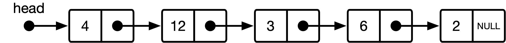
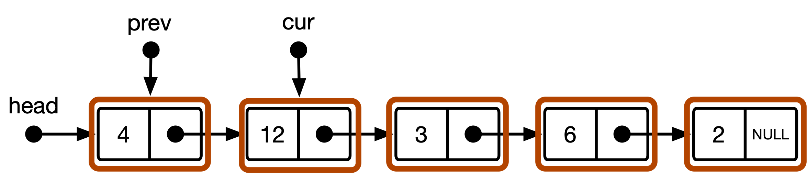
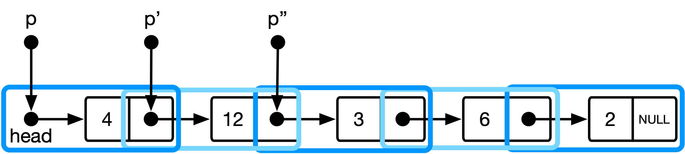

# 链表、指针技巧与编程品味


* [简介](#简介)
* [代码](#代码)
   * [CS101版本](#cs101-版本)
   * [更优雅的解决方案](#更优雅的解决方案)
* [它是如何工作的](#它是如何工作的)
   * [集成头指针](#集成头指针)
   * [维护了一个句柄 (handle)](#维护了一个句柄--handle)
* [拓展](#拓展)
   * [在已有元素前做些修改](#在已有元素前做些修改)
   * [简单重构](#简单重构)
   * [实现 `insert_before()`](#实现-insert_before)
* [总结](#总结)

## 简介

<div style="max-width:854px"><div style="position:relative;height:0;padding-bottom:56.25%"><iframe src="https://embed.ted.com/talks/lang/en/linus_torvalds_the_mind_behind_linux" width="854" height="480" style="position:absolute;left:0;top:0;width:100%;height:100%" frameborder="0" scrolling="no" allowfullscreen></iframe></div></div>

在 [2016 年的 TED 采访](https://www.ted.com/talks/linus_torvalds_the_mind_behind_linux)上（14:10 处），Linux 的创始人 Linus Trovalds 谈及了他认为编程时所谓的**好品位**。主持人展示了单链表中删除项的两种实现（文中将随后复现）。其中一种实现需要一个特别的条件语句来进行特判而另一个实现不需要。Linus, 亦如我们所料，偏好后一种。

他评述道：
>    [...] 我不会识图让你理解为什么它不包含 `if` 语句。
>    我想让你理解的是有时候你从另一个角度思考问题来重写代码好让特殊情况消失而成为了一般情况，那就得到了一段好的代码。
>
>    [...] -- L. Torvalds

采访中展示的代码片段是 C 语言风格的伪代码，非常简单。然而，正如 Linus 在评述中提到的那样，这些伪代码缺乏概念上的解释，并且无法立即看出更优雅的解决方案实际上是如何工作的

接下来的两节将详细讨论技术实现的方法，并演示间接寻址方法是如何以及为什么如此简洁。最后一节将解决方案从删除项扩展到插入项。

## 代码

整数单链表的基本数据结构如图1所示。


<p align="center">
    
    </img>
    <br>
    <b>图1</b>：带头指针的整数的单链表的数据结构
</p>


这里的数字是任意选择的整数值，箭头表示指针。 `head` 是一个类型为 `list_item *` 的指针，每个盒子都是一个 `list_item` 结构体的实体，每个盒子都有一个类型为 `list_item *` 的成员变量（在代码中称为 `next` ）指向下一个盒子。

用 C 语言来实现它的数据结构则是：

```C
struct list_item {
        int value;
        struct list_item *next;
};
typedef struct list_item list_item;

struct list {
        struct list_item *head;
};
typedef struct list list;
```

我们还包括一个（最小的）API：

```C
/* The textbook version */
void remove_cs101(list *l, list_item *target);
/* A more elegant solution */
void remove_elegant(list *l, list_item *target);
```

有了这些，让我们来看看 `remove_cs101()` 和 `remove_elegant()` 的实现。这些示例的代码与Linus示例中的伪代码相同，并且也可以编译和运行。

### CS101 版本

<p align="center">
    
    </img>
    <br>
    <b>图2</b>：CS101算法中链表数据结构的概念模型
</p>

```C
void remove_cs101(list *l, list_item *target)
{
        list_item *cur = l->head, *prev = NULL;
        while (cur != target) {
                prev = cur;
                cur = cur->next;
        }
        if (prev)
                prev->next = cur->next;
        else
                l->head = cur->next;
}
```

标准CS101方法利用两个遍历指针 `cur` 和 `prev` ，分别标记列表中的当前位置和前一个位置。 `cur` 从链表的头指针 `head` 开始，并且前进，直到找到要删除的 `target`。 `prev` 从 `NULL` 开始，并且随后每当 `cur` 遍历一个元素时用先前的值 `cur` 更新。在找到目标之后，算法测试 `prev` 是否为非 `NULL` 。如果是，则要删除的项不在链表的开始处，并且移除包括围绕 `cur` 重新链表。如果 `prev` 是 `NULL` ，此时 `cur` 指向列表中的第一项（也就是我们要删除的项），在这种情况下，删除项意味着将链表头指针向后移动。

> <p style="font-size:0.8em">译注：代码有内存泄漏的问题，不过关键是理解其中思想</p>

### 更优雅的解决方案

更优雅的版本具有更少的代码，并且不需要单独的分支来处理链表中第一个元素的删除。

```C
void remove_elegant(list *l, list_item *target)
{
        list_item **p = &l->head;
        while (*p != target)
                p = &(*p)->next;
        *p = target->next;
}
```

代码使用间接指针 `p` ，它保存指向链表项的指针的地址，从 `head` 的地址开始。在每次迭代中，该指针前进以保持指向下一链表项的指针的地址，即当前 `list_item` 中的 `next` 元素的地址。当指向链表项 `*p` 的指针等于 `target` 时，我们退出搜索循环并从列表中删除该项。

## 它是如何工作的？

关键的理解是，使用间接指针 `p` 有两个概念上的好处：

1. 它允许我们以一种使 `head` 指针成为数据结构的一个组成部分的方式来解释链表。这消除了移除第一项的特殊情况的需要。
2. 它还允许我们评估 `while` 循环的条件，而不必释放指向 `target` 的指针。这允许我们修改指向 `target` 的指针，并使用单个迭代器，而不是 `prev` 和 `cur` 。

让我们依次来看这些要点：

### 集成头指针

标准模型将链表解释为 `list_item` 实例的序列。序列的开始可以通过 `head` 指针访问。这就产生了上面图2所示的概念模型。 `head` 指针仅仅被认为是访问列表开始的句柄。 `prev` 和 `cur` 是类型为 `list_item *` 的指针，总是指向一个项或 `NULL` 。

优雅的实现使用间接寻址方案，产生数据结构的不同视图：

<p align="center">
    
    </img>
    <br>
    <b>图3</b>：更优雅的方法中链表数据结构的概念模型。
</p>

这里， `p` 是类型 `list_item **` ，并且保存指向当前链表项的指针的地址。当我们前进指针时，我们前进到指针的地址，指向下一个链表项。

在代码中，这翻译为 `p = &(*p)->next` ，意味着我们:
1. `(*p)` ：取消引用 ( dereference ) 指向当前链表项指针的地址
2. `->next` ：再次取消引用该指针，并选择保存下一个链表项地址的字段
3. `&` ：获取该地址字段的地址（即获取指向它的指针）

这对应另一种对于数据结构的解释，其中链表是一个指向 `list_item s` 的指针的序列（参见图3）。

### 维护了一个句柄 ( handle )

这种理解的另一个好处是，它支持在整个遍历过程中编辑当前项的前一项的 next 指针。
由于 `p` 保存指向列表项的指针的地址，搜索循环中的比较变为：

```C
while (*p != target)
```
如果 `*p` 等于 `target` ，则搜索循环将退出，并且一旦它这样做，我们仍然能够修改 `*p` ，因为我们持有其地址 `p` 。因此，即使迭代循环直到我们命中 `target` ，我们仍然保持一个句柄（ `next` 字段的地址或 `head` 指针），可以用来直接修改指向项的指针。

这就是为什么我们可以使用 `*p = target->next` 来修改将要遍历的项的指针到一个不同的位置，以及为什么我们不需要 `prev` 和 `cur` 指针来遍历链表以删除项目。

## 拓展

事实证明， `remove_elegant()` 背后的思想可以用于在链表API中生成另一个函数的特别简洁的实现： `insert_before()` ，即在另一个项之前插入给定的元素。

### 在已有元素前做些修改

首先，让我们将以下声明添加到 `list.h` 中：

```C
void insert_before(list *l, list_item *before, list_item *item);
```

该函数将获取指向列表 `l` 的指针、指向该列表中的项的指针 `before` 以及指向该函数将插入在 `before `之前的新项 `item` 的指针。

### 简单重构

在继续之前，我们将搜索循环重构为一个单独的函数：

```C

static inline list_item **find_indirect(list *l, list_item *target)
{
        list_item **p = &l->head;
        while (*p != target)
                p = &(*p)->next;
        return p;
}
```

并在 `remove_elegant()` 中使用该函数，如下所示：

```C
void remove_elegant(list *l, list_item *target)
{
        list_item **p = find_indirect(l, target);
        *p = target->next;
}
```

### 实现 `insert_before()`

使用 `find_indirect()` ，可以直接实现 `insert_before()` ：

```C
void insert_before(list *l, list_item *before, list_item *item)
{
        list_item **p = find_indirect(l, before);
        *p = item;
        item->next = before;
}
```

一个特别漂亮的结果是，实现对边缘情况具有一致的语义：如果 `before` 指向列表头，则在列表的开头插入新项，如果 `before` 是 `NULL` 或无效（即该项不存在于 `l` 中），则在末尾追加新项。

## 总结

更优雅的元素删除解决方案的前提是一个简单的更改：使用间接 `list_item **` 指针来迭代指向列表项的指针。其他的一切都是从这里开始的：不需要处理特殊情况或分支，并且单个迭代器足以找到并移除目标项。利用同样的方法也提供了一个优雅的解决方案，用于一般的项插入，特别是在现有项之前的插入。

回到 Linus 最初的评论：品味很好吗？很难说，但它肯定是一个对于我们都知道的计算机科学问题的不同的，创造性的，非常优雅的解决方案。